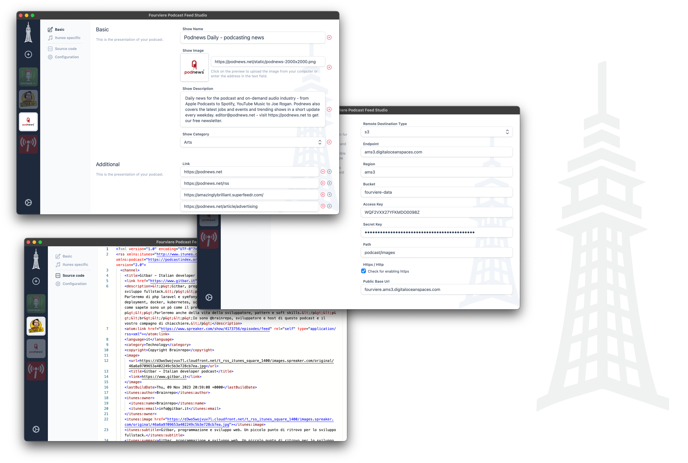

# Fourviere Podcast

The feed editor for the open podcasting

Fourviere is an opensource Podcast RSS feed editor that supports all the podcasting 2.0 tags and allow to publish the feed and the episode via FTP or Amazon S3 ecc...

# What is open podcasting

Open podcasting refers to the concept of creating and distributing podcasts in **an open and decentralized manner**, allowing for greater accessibility, interoperability, and freedom in the podcasting ecosystem. It stands in contrast to closed or proprietary podcasting platforms and ecosystems.

## Key characteristics of open podcasting include:

### Open Standards:

Open podcasting relies on open and widely adopted standards, such as **RSS (Really Simple Syndication)** feeds with enclosures. This means that anyone can create, distribute, and consume podcasts using these standards without being tied to a specific platform.

### Interoperability:

Open podcasting encourages compatibility among various podcasting apps and platforms. Podcast listeners can choose from a wide range of apps and services to subscribe to and listen to podcasts, without being limited to a single closed ecosystem.

### Freedom of Choice:

Content creators and listeners have the freedom to use the tools and services of their choice. Creators can host their podcasts on their own servers or with hosting providers of their choosing, while listeners can use any compatible podcast app to access the content.

### No Gatekeepers:

Open podcasting doesn't rely on gatekeepers or exclusive distribution deals. Anyone can start a podcast, and the content is not subject to centralized control or censorship.

### Accessibility:

Open podcasting is generally more accessible because it doesn't require special permissions, approvals, or fees to create or distribute content. This openness promotes a diverse range of voices and content.

### Content Ownership:

Creators retain ownership and control over their podcast content. They are not beholden to a platform or network's terms and conditions.

# How to run the application

## Prerequisite

Nodejs and Rust should be installed in your machine

## Make it working

- Clone the repository
- Run `npm install` from the project's root folder
- Run `npm run dev` from the projects root folder
